

  

  <h1>oddicons</h1>

  
Free, weird, AI-generated icons you can browse, copy, and download.

  

    
    
    
  

## Use

Open [oddicons.net](https://oddicons.net/) to search the pack, copy individual icons, or download a set.

## Request Icons

Want something that is not in the pack? [Open an icon request](https://github.com/jasperdevs/oddicons/issues/new?title=Icon%20request%3A%20&body=%23%23%23%20Icon%20name%0A%0A%0A%23%23%23%20What%20should%20it%20look%20like%3F%0A%0A%0A%23%23%23%20Useful%20references%0A%0A) and say what you want.

Please request new icons through issues instead of submitting icon files directly.

## Icons

<!-- BEGIN ICON TABLE -->
_Generated from `src/data/icons.json`. Run `npm run readme` after adding icons._

### Arrows

| Icon | Name |
| --- | --- |
|  | Arrow Up |
|  | Arrow Down |
| 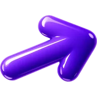 | Arrow Left |
|  | Arrow Right |

### Interface

| Icon | Name |
| --- | --- |
|  | Check |
|  | Close |
|  | X |
|  | Plus |
|  | Minus |
|  | Menu |
| 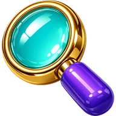 | Search |
| 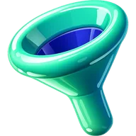 | Filter |
| 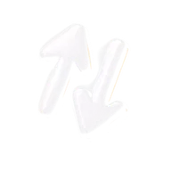 | Sort |
|  | Sort Az |
|  | Sort Az Ascending |
|  | Settings |
|  | Trash |
| 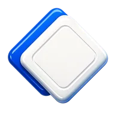 | Copy |
| 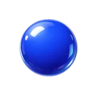 | Dot |
|  | Hashtag |
|  | At |
|  | Percent |
|  | Question |
|  | Exclamation |
| 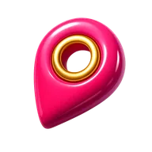 | Pin |
|  | Send |

### Cursors

| Icon | Name |
| --- | --- |
|  | Cursor |
|  | Text Cursor |
|  | Hand Pointer |
| 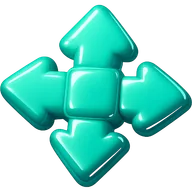 | Move |
|  | Grab |

### Commerce

| Icon | Name |
| --- | --- |
|  | Bag |
| 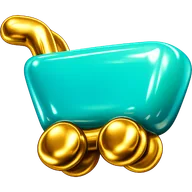 | Cart |
| 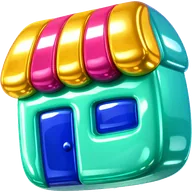 | Shop |
| 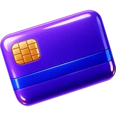 | Card |
|  | Cash |
|  | Coin |
|  | Dollar |
|  | Money Bag |
|  | Wallet |
|  | Gift |
| 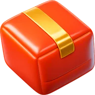 | Package |
|  | Truck |
| 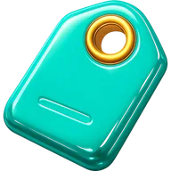 | Tag |
|  | Crown |
| 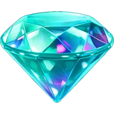 | Diamond |
|  | Trophy |

### Communication

| Icon | Name |
| --- | --- |
|  | Mail |
|  | Message |
|  | Bell |
|  | Phone |
| 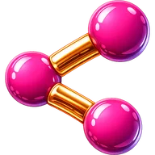 | Share |
|  | Link |
|  | Users |

### Files

| Icon | Name |
| --- | --- |
| 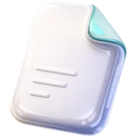 | File |
| 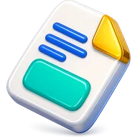 | Document |
|  | Folder |
|  | Bookmark |
|  | Edit |
|  | Download |
|  | Upload |
|  | License |

### Media

| Icon | Name |
| --- | --- |
| 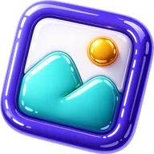 | Image |
|  | Music |
| 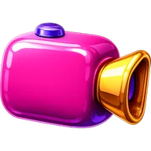 | Video |

### Time

| Icon | Name |
| --- | --- |
| 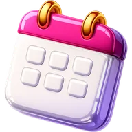 | Calendar |
|  | Clock |

### Nature

| Icon | Name |
| --- | --- |
|  | Sun |
|  | Moon |
|  | Star |
|  | Sparkles |
| 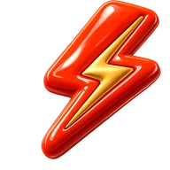 | Bolt |
|  | Planet |
|  | Globe |

### Objects

| Icon | Name |
| --- | --- |
| 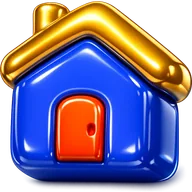 | House |
|  | Lock |
| 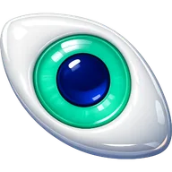 | Eye |
|  | Heart |
|  | Chart |
|  | Dice |
|  | Bomb |
|  | Cat |
|  | Skull |

### Brands

| Icon | Name |
| --- | --- |
|  | Github |
|  | Discord |
| 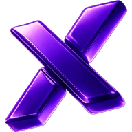 | X Twitter |
|  | Instagram |
|  | Reddit |
|  | Youtube |
|  | Tiktok |
|  | Spotify |
|  | Gmail |
|  | Chatgpt |
|  | Claude |
|  | Gemini |
|  | Paypal |
|  | Kofi |
|  | Codex |
<!-- END ICON TABLE -->

## License

Released under the terms in [LICENSE](./LICENSE).
